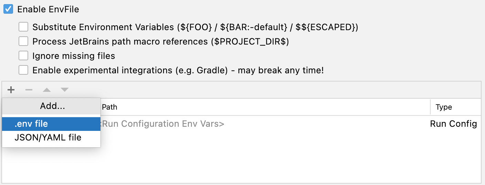

# used-car

## setup

1. .env 파일을 생성하고 MySQL 패스워드를 임의로 설정합니다.
```text
MYSQL_PASSWORD=1234
MYSQL_ROOT_PASSWORD=qwer@1234
```

2. docker compose 를 실행합니다.
```shell
docker-compose up
```

3. IntelliJ 실행시 .env 파일을 추가하도록 실행 옵션을 넣습니다.
   
숨겨진 파일을 보려면 macos 에서는 (command + shift + .)를, windows 에서는 '보기' > '숨긴 항목' 을 체크합니다.  

